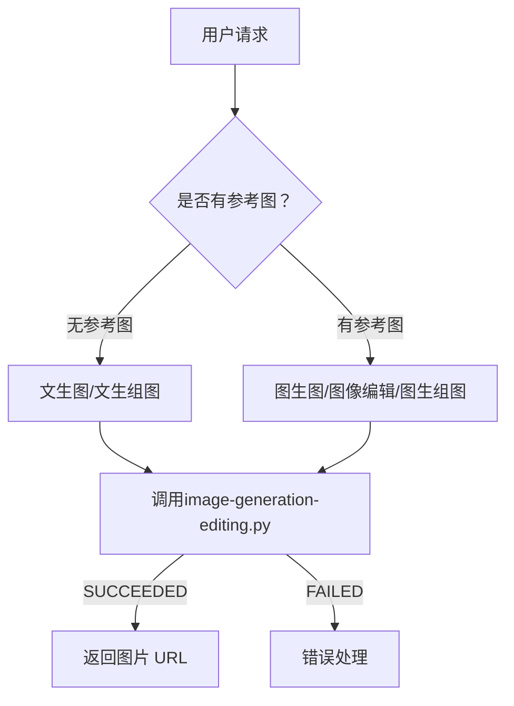

# Wan2.7 Image Generation Skill （Wan2.7 图片生成编辑技能）

Generate AI images with "Wan2.7 Image" via direct API calls.

---

## Quick Start

**1. 配置环境** → [common.md](references/common.md)  
**2. 了解能力** → 阅读下文核心能力介绍  
**3. 选择模式** → 根据需求选择三种操作模式之一  
**4. 详细用法** → [image-generation-editing.md](references/image-generation-editing.md)

**核心能力：**
- ✅ **文生图**：纯文本生成单张图像
- ✅ **图像编辑**：基于参考图的编辑、风格迁移、多图融合
- ✅ **组图生成**：文生组图、图生组图（最多 12 张）

---

## Workflow: Unified Image Generation & Editing（统一图像生成与编辑）



**流程说明：**
1. **判断模式** - 根据是否有参考图以及用户内容，选择文生图,图生图还是组图生成
2. **预处理脚本执行** - 根据输入情况自动选择：
   - **有文件路径**：调用 `scripts/file_to_oss.py --file` 上传文件到OSS
   - **有 base64 数据**（如Claw chat框粘贴场景）：调用 `scripts/file_to_oss.py --base64` 上传到OSS
   - **有分辨率和长宽比的需求**：执行 `scripts/parse_resolution.py` 获取size配置
3. **调用生成脚本** - 调用 `scripts/image-generation-editing.py`，根据下述三种操作模式进行对应的参数填充
4. **获取结果** - 从响应中提取图片 URL（有效期 24 小时）
5. **展示结果** - 把图片URL在用户交互界面中显示出来
6. **保存图片** - 提示用户图片结果链接有有效期，如果用户想长期保存结果，让用户指定一个目录，把图片存进这个目录

📖 **详细流程与参数：** [image-generation-editing.md](references/image-generation-editing.md)

---

## Three Operation Modes（三种操作模式）

### Mode 1: 图像生成（文生图）

**用途：** 纯文本生成单张图像

**输入：** 文本提示词  
**输出：** 图片  
**特点：** 无需输入参考图

**关键参数：**
- `enable_sequential`: false
- `n`: 生成数量 1
- `size`: 分辨率 (支持 1K/2K 或自定义)

📖 **详细说明与用例：** [image-generation-editing.md#mode-1](references/image-generation-editing.md)

---

### Mode 2: 图像编辑（图生图、风格迁移、多图融合）

**用途：** 基于参考图像进行编辑、风格迁移或保持主体一致性生成

**输入：** 文本提示词 + 1-9 张参考图  
**输出：** 图片  
**特点：** 输入1-9张参考图进行参考生成

**关键参数：**
- `enable_sequential`: false
- `n`: 生成数量 1
- `size`: 分辨率（支持 1K/2K 或自定义）

📖 **详细说明与用例：** [image-generation-editing.md#mode-2](references/image-generation-editing.md)

---

### Mode 3: 组图生成

**用途：** 根据文本描述生成系列图像（一次生成多张关联的图片，教程、故事等）

**输入：** 文本提示词 + 可选参考图（最多 9 张）  
**输出：** 最多 12 张图片  
**特点：** 一次生成多张关联的图片，实际数量由模型决定

**关键参数：**
- `enable_sequential`: true
- `n`: 生成数量范围 [1-12]
- `size`: 分辨率 （支持 1K/2K 或自定义）

📖 **详细说明与用例：** [image-generation-editing.md#mode-3](references/image-generation-editing.md)

---

## Documents Structure（文档结构）

### 📖 [Common Configuration](references/common.md)

**用途：** 通用配置和环境变量管理

**包含内容：**
- API Key 获取和配置步骤
- 环境变量配置（DASHSCOPE_API_KEY, DASHSCOPE_BASE_URL）
- 地域选择（北京、新加坡）

**何时查阅：** 首次配置环境或需要修改配置时

---

### 📖 [Image Generation & Editing](references/image-generation-editing.md)

**用途：** Wan 2.7 统一技能详细文档

**包含内容：**
- 三种操作模式的详细说明和用例（Mode 1/2/3）
- 图像输入要求（格式、分辨率、大小、宽高比）
- 分辨率转换脚本使用说明（parse_resolution.py）

**何时查阅：** 需要了解具体 API 用法、参数配置或排查问题时

---

### 📖 [Upload to OSS](scripts/file_to_oss.py)

**用途：** 本地文件或 base64 图片数据上传到临时 OSS 存储的 Python 脚本

**包含内容：**
- 文件上传功能实现
- 获取 oss:// URL
- 支持文件路径和 base64 两种输入方式
- 支持所有需要本地文件的场景，如果用户在聊天框粘贴传入参考图，请把这些参考图，以 base64 形式传递给脚本

**何时查阅：** 需要上传本地图片用于图生图、图像编辑、图生组图时

**使用示例：**
```bash
# 方式 1: 从文件路径上传
python scripts/file_to_oss.py --file /tmp/image.jpg --model wan2.7-image

# 方式 2: 从 base64 数据上传（OpenClaw 场景）
python scripts/file_to_oss.py --base64 "<base64_data>" --model wan2.7-image

# 输出：oss://dashscope-instant/xxx/cat.png
```

---

### 📖 [Parse resolution](scripts/parse_resolution.py)

**用途：** 解析用户输入的分辨率描述，转换为 API 所需的 size 参数。

**包含内容：**
- 用户输入中有分辨率，1K，2K，2:4 等相关内容
- K + 比例：`"2K 3:4"`, `"1K 16:9"`
- 仅 K 值：`"1K"`, `"2K"`（默认 1:1）
- 直接指定：`"1024*1024"`, `"2048*2048"`

**何时查阅：** 需要解析用户分辨率需求时（如：当用户即对分辨率有要求又对宽高比有要求时，解析用户输入的分辨率描述），转换使用

**使用示例：**
```bash
python scripts/parse_resolution.py "2K 3:4"
# 输出：1774*2364
```

---

## 📖 生成任务耗时过长及异步任务查询

**何时使用：** 
当用户调用scripts/image-generation-editing.py 用时太长时，脚本不会等待最终输出结果，会主动输出task_id。
后续每隔10秒用scripts/check_wan_task_status.py 脚本，查询该task_id所对应的任务的状态。连续查询3次，若有url输出则说明最终完成了任务；若还在进行中，则显示该task_id，提示用户之后再用task_id进行查询。

**重要原则**
当多次查询都还在生成进行中（RUNNING），则告知用户task_id，提示用户之后再用task_id进行查询。绝对不要私自更改用户的需求，例如减少参考图片的张数和生成组图的张数。

**使用示例：**
```bash
python scripts/check_wan_task_status.py "<task_id>"
```

---

## Error Handling

常见错误及解决方案：

| 错误 | 原因 | 解决方案 |
|------|------|----------|
| API key not provided | 未设置 API Key | 设置 `DASHSCOPE_API_KEY` 环境变量 |
| 请求失败：code=XXX | API 调用失败 | 检查网络连接、API Key 有效性、模型可用性 |
| 解析响应失败 | 响应格式异常 | 查看原始响应，参考 DashScope 文档 |

详细错误码参考：[DashScope 错误码文档](https://help.aliyun.com/zh/model-studio/developer-reference/error-code)

---

## Related Documents

- 📖 [common.md](references/common.md) - 环境配置的说明文档
- 📖 [image-generation-editing.md](references/image-generation-editing.md) - 文生图/图生图/编辑/组图生成的细节和例子的说明文档
- 🐍 [file_to_oss.py](scripts/file_to_oss.py) - 本地文件上传脚本
- 🐍 [parse_resolution.py](scripts/parse_resolution.py) - 解析用户输入的分辨率的脚本
- 🐍 [image-generation-editing.py](scripts/image-generation-editing.py) - 文生图/图生图/编辑/组图生成的脚本
